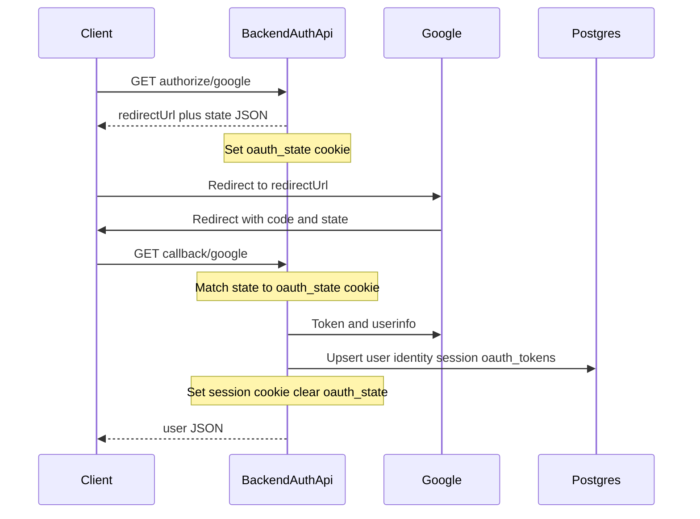

# Authentication System

This document describes the Google OAuth authentication system for the Inbox Concierge application, as implemented in [`packages/backend`](../../packages/backend).

## Table of Contents

1. [Architecture Overview](#architecture-overview)
2. [Configuration Guide](#configuration-guide)
3. [Google OAuth Setup](#google-oauth-setup)
4. [Security Considerations](#security-considerations)
5. [Troubleshooting](#troubleshooting)

---

## Architecture Overview

The authentication system uses **Google OAuth 2.0** as the sole authentication provider. All server-side auth code lives under **`packages/backend`**: domain models and errors, ports, adapters, use cases, and HTTP entrypoints built with Effect **`HttpApi`** groups.

### Core Components

```
┌─────────────────────────────────────────────────────────────────────┐
│  HTTP: AuthApi (public) + AuthSessionApi (protected)                 │
│  Middleware: Authorization (session cookie → CurrentUser + Session)  │
└───────────────────────────────────┬─────────────────────────────────┘
                                    │
                                    ▼
┌─────────────────────────────────────────────────────────────────────┐
│  Use cases: getAuthorizationUrl, handleOAuthCallback, refreshSession,│
│  validateSession (internal), logout, get current user                 │
└───────────────────────────────────┬─────────────────────────────────┘
                                    │
                    ┌───────────────┴───────────────┐
                    ▼                               ▼
            ┌──────────────┐               ┌────────────────┐
            │ AuthProvider │               │ Repositories   │
            │  (Google)    │               │ (Postgres SQL) │
            └──────────────┘               └────────────────┘
```

### Package layout (`packages/backend`)

| Area          | Path (under `packages/backend/src/`)             | Purpose                                                                                                                                                                                                                |
| ------------- | ------------------------------------------------ | ---------------------------------------------------------------------------------------------------------------------------------------------------------------------------------------------------------------------- |
| **Domain**    | `domain/`                                        | `AuthUser`, `Session`, identity and OAuth token models, DTOs (`AuthResult`, `OAuthTokenData`), tagged errors                                                                                                           |
| **Ports**     | `ports/`                                         | `AuthProvider`, `SessionRepository`, `UserRepository`, `IdentityRepository`, `OAuthTokenRepository`, `TokenEncryption`, `GenerateSessionToken`                                                                         |
| **Adapters**  | `adapters/`                                      | Google OAuth client (`AuthProviderGoogleLive`), SQL repositories, AES-GCM token encryption, session ID generation                                                                                                      |
| **Use cases** | `use-cases/`                                     | `getAuthorizationUrl`, `handleOAuthCallback`, `refreshSession`, `validateSession`, logout, `getCurrentUser`, plus post-login **`initializeNewUser`** (default labels and inbox sync enqueue) from the callback handler |
| **HTTP**      | `entrypoints/http/groups/auth/`                  | `AuthApi` and `AuthSessionApi` groups, route handlers                                                                                                                                                                  |
| **HTTP**      | `entrypoints/http/middleware/auth.middleware.ts` | `Authorization` middleware (cookie security)                                                                                                                                                                           |

The web app (`packages/web`) consumes these HTTP APIs; it does not embed Effect auth logic.

### Key types (representative)

| Type            | Location                                         | Description                                                       |
| --------------- | ------------------------------------------------ | ----------------------------------------------------------------- |
| `AuthProvider`  | `ports/auth-provider.port.ts`                    | Strategy: authorization URL + OAuth callback exchange             |
| `AuthUser`      | `domain/models/auth-user.ts`                     | Authenticated user (email, role, `primaryProvider`, etc.)         |
| `Session`       | `domain/models/session.ts`                       | Server session row (`expiresAt`, provider, optional audit fields) |
| `AuthIdentity`  | `domain/models/auth-identity.ts`                 | Links a user to a provider account                                |
| `Authorization` | `entrypoints/http/middleware/auth.middleware.ts` | HttpApi middleware; provides `CurrentUser` and `CurrentSession`   |

### Authentication flow

1. Client calls **`GET /api/auth/authorize/google`** and receives `{ redirectUrl, state }`.
2. Server sets an **`oauth_state`** httpOnly cookie (short-lived) with the same state value for verification on return.
3. User signs in at Google and is redirected to **`GET /api/auth/callback/google?code=...&state=...`**.
4. Server compares **`state`** query param to the **`oauth_state`** cookie; mismatch → **`OAuthStateError`**.
5. **`handleOAuthCallback`** exchanges the code for tokens and userinfo, finds or creates **`auth_users`** / **`auth_identities`**, optionally persists **encrypted** OAuth tokens in **`oauth_tokens`**, creates an **`auth_sessions`** row (24-hour server-side expiry).
6. Server sets the **`session`** cookie (session id) and clears **`oauth_state`**. Response body includes **`{ user }`**.
7. For **new** users, the callback handler runs **`initializeNewUser`**, which seeds default labels and **`enqueueInboxSync`** (job on **`InboxSyncQueue`**). The **inbox sync worker** consumes that job and runs **`syncUserThreads`** (Gmail fetch and persistence); classification runs after messages exist (e.g. via **`syncUserThreads`**), not during init.



---

## Configuration Guide

### Environment variables

#### Encryption (OAuth tokens at rest)

| Variable         | Type                  | Required | Description                                                                                                                      |
| ---------------- | --------------------- | -------- | -------------------------------------------------------------------------------------------------------------------------------- |
| `ENCRYPTION_KEY` | redacted string (hex) | Yes      | **64 hex characters** (32 bytes) for AES-256-GCM. Used to encrypt Google access/refresh tokens before storing in `oauth_tokens`. |

#### Google OAuth

All prefixed with `AUTH_GOOGLE_`:

| Variable                    | Type   | Required | Description                                                                                               |
| --------------------------- | ------ | -------- | --------------------------------------------------------------------------------------------------------- |
| `AUTH_GOOGLE_CLIENT_ID`     | string | Yes      | OAuth client ID from Google Cloud Console                                                                 |
| `AUTH_GOOGLE_CLIENT_SECRET` | string | Yes      | OAuth client secret (loaded as `Config.redacted` in code)                                                 |
| `AUTH_GOOGLE_REDIRECT_URI`  | string | Yes      | Callback URL (must match Google Console exactly), e.g. `https://app.example.com/api/auth/callback/google` |

#### Session duration and default role

Session lifetime is **fixed in code**: **`SESSION_DURATION_HOURS = 24`** when creating or refreshing a session (see `handle-oauth-callback.use-case.ts` and `refresh-session.use-case.ts`). It is **not** configured via `AUTH_SESSION_DURATION` or similar.

New users receive **`role: "user"`** in code; there is no `AUTH_DEFAULT_ROLE` environment variable.

### Example configuration

```bash
# .env file

# OAuth token encryption at rest (64 hex chars = 32 bytes)
ENCRYPTION_KEY=0123456789abcdef0123456789abcdef0123456789abcdef0123456789abcdef

# Google OAuth
AUTH_GOOGLE_CLIENT_ID=123456789-abcdef.apps.googleusercontent.com
AUTH_GOOGLE_CLIENT_SECRET=GOCSPX-abc123
AUTH_GOOGLE_REDIRECT_URI=https://app.example.com/api/auth/callback/google
```

---

## Google OAuth Setup

### 1. Create OAuth credentials in Google Cloud Console

1. Go to [Google Cloud Console](https://console.cloud.google.com)
2. Navigate to **APIs & Services** > **Credentials**
3. Click **Create Credentials** > **OAuth client ID**
4. Select **Web application**
5. Add authorized redirect URIs:
   - Development: `http://localhost:3000/api/auth/callback/google` (adjust port to match your backend)
   - Production: `https://yourdomain.com/api/auth/callback/google`
6. Enable the **Gmail API** if you rely on `gmail.readonly` (required for inbox features)
7. Copy the Client ID and Client Secret

### 2. Configure environment variables

```bash
AUTH_GOOGLE_CLIENT_ID=123456789-xxxx.apps.googleusercontent.com
AUTH_GOOGLE_CLIENT_SECRET=GOCSPX-xxxxxxxxxxxx
AUTH_GOOGLE_REDIRECT_URI=https://yourdomain.com/api/auth/callback/google
ENCRYPTION_KEY=<64-character-hex>
```

### 3. OAuth flow endpoints

1. **Get authorization URL**: `GET /api/auth/authorize/google`

   ```json
   {
     "redirectUrl": "https://accounts.google.com/o/oauth2/v2/auth?...",
     "state": "csrf_protection_token"
   }
   ```

   The handler also sets the **`oauth_state`** cookie so the callback can verify the **`state`** query parameter.

2. **Handle callback**: `GET /api/auth/callback/google?code=...&state=...`
   - Exchanges code for tokens
   - Fetches user profile from Google
   - Creates or links user and identity; stores encrypted OAuth tokens when present
   - Creates server session and sets **`session`** cookie
   - Returns **`{ user }`**

### Google OAuth scopes

The Google adapter requests:

- `openid` — OpenID Connect
- `email` — Email address
- `profile` — Profile info (name, picture)
- `https://www.googleapis.com/auth/gmail.readonly` — Read Gmail (inbox sync and classification)

Additional authorization parameters:

- **`access_type=offline`** — Request refresh token when Google issues one
- **`prompt=select_account`** — Account picker on each authorization

### User data retrieved

From Google's userinfo endpoint:

- `id` — Google user ID (stored as provider ID)
- `email` — Email address
- `verified_email` — Email verification status
- `name` — Display name (with fallback from given/family name or email)
- `given_name` / `family_name` — Name parts
- `picture` — Profile picture URL (stored in `provider_data` JSON)

### Account linking

If Google returns an email that already exists in **`auth_users`** but the Google identity is new, the backend **creates a new row in `auth_identities`** for that user instead of failing with a duplicate-email error.

---

## Security Considerations

### CSRF protection (OAuth state)

1. Server generates cryptographically random **state** (see `get-authorization-url.use-case.ts`).
2. **State** is included in the authorization URL and returned in the JSON body for clients that need it.
3. The same value is stored in the **`oauth_state`** httpOnly cookie on **`GET /api/auth/authorize/google`**.
4. On **`GET /api/auth/callback/google`**, the server compares the **`state`** query parameter to the **`oauth_state`** cookie. They must match.

```typescript
// State generation (conceptually matches use case)
const bytes = new Uint8Array(32);
crypto.getRandomValues(bytes);
const state = btoa(String.fromCharCode(...bytes))
  .replace(/\+/g, "-")
  .replace(/\//g, "_")
  .replace(/=+$/, "");
```

### Session management

**Session IDs**:

- Generated as URL-safe base64 from 32 random bytes (`GenerateSessionToken` / `session-token-generator.adapter.ts`).
- Stored server-side in PostgreSQL **`auth_sessions`**.
- Sent to the browser as the **`session`** cookie (not localStorage).

**Server-side expiry**: Session rows use **`expires_at = now + 24 hours`** when created or refreshed.

**Cookie vs database lifetime**:

- Handlers set the **`session`** cookie with a **longer browser lifetime** (currently **7 days** `maxAge` in callback and refresh handlers) while the **database row expires after 24 hours**.
- After **`expires_at`**, the `Authorization` middleware treats the session as invalid (and may delete the row). The browser may still hold a cookie until it expires; requests then receive **401** until the user signs in again.

**Logout**: Clears the **`session`** cookie and removes the session row.

### Cookies summary

| Cookie            | Role                                | Typical flags                                                                                   |
| ----------------- | ----------------------------------- | ----------------------------------------------------------------------------------------------- |
| **`oauth_state`** | Binds OAuth round-trip; short-lived | `httpOnly`, `secure`, `sameSite: "lax"`, ~10 minutes                                            |
| **`session`**     | Session id for API authentication   | Set via HttpApi security helpers with `sameSite: "strict"`, path `/`, `maxAge` 7 days (browser) |

### Token storage (client-side)

**Session identifiers MUST be carried in httpOnly cookies for API requests. Do not put session tokens in localStorage.**

**Why httpOnly cookies help**:

- **XSS**: Scripts cannot read httpOnly cookies, reducing token exfiltration risk compared to `localStorage`.
- **Transport**: The browser attaches cookies to same-site API calls when configured appropriately.

**Why `sameSite: "strict"` on `session`** reduces CSRF for cookie-authenticated API calls from other sites.

### OAuth token storage (server-side)

Google **access** and **refresh** tokens are persisted in **`oauth_tokens`** as **AES-256-GCM ciphertext** (see `token-encryption.adapter.ts` and `oauth-token-repository.adapter.ts`). The application reads **`ENCRYPTION_KEY`** (64 hex chars) at startup. Plaintext tokens never belong in logs; domain types use **`Redacted`** where appropriate.

### API security

Protected routes use the **`Authorization`** HttpApi middleware (`auth.middleware.ts`):

- **Security scheme**: Cookie named **`session`** (`HttpApiSecurity.apiKey({ key: "session", in: "cookie" })`).
- **On success**: Provides **`CurrentUser`** and **`CurrentSession`** to the handler.
- **On failure**: **`UnauthorizedError`** (HTTP 401) — missing cookie, invalid session id, expired session, or missing user.

There is **no** Bearer-token scheme for browser session auth in this middleware.

### Secrets management

- Never commit secrets or `ENCRYPTION_KEY` to version control.
- Use a secret manager in production and rotate keys with a defined process (re-encrypting stored tokens is a separate operational concern).

**Redacted configuration**:

```typescript
// Example: client secret and encryption key loaded as redacted
const clientSecret = yield * Config.redacted("AUTH_GOOGLE_CLIENT_SECRET");
const keyHex = yield * Config.redacted("ENCRYPTION_KEY");
```

---

## Troubleshooting

### Common issues

#### OAuth callback errors

**"State mismatch" / `OAuthStateError`**:

- Cause: **`state`** query param does not match **`oauth_state`** cookie
- Possible reasons: cookie blocked, wrong site, expired oauth cookie, different browser profile, multiple tabs overwriting cookie
- Solution: Start the flow again from **`GET /api/auth/authorize/google`**

**Token exchange / provider failures (`ProviderAuthFailedError`)**:

- Cause: Google rejected the authorization code or userinfo request failed
- Possible reasons: code already used, code expired, redirect URI mismatch, invalid client credentials
- Solution: Verify **`AUTH_GOOGLE_REDIRECT_URI`** matches Google Console exactly; retry the flow

**"Invalid client"**:

- Cause: Wrong client ID or secret
- Solution: Verify credentials in Google Cloud Console

#### Session issues

**401 Unauthorized / "Authentication required"**:

- Session row expired (~24h), logged out, or cookie not sent (wrong domain/path/`Secure`)
- Solution: Sign in again; for local dev ensure HTTPS or cookie settings match your environment

#### Database errors

**Migrations not applied**:

- Solution: Run backend database migrations for `packages/backend`

**Duplicate key on `auth_identities (provider, provider_id)`**:

- That Google account is already linked
- Solution: Sign in with the same Google user or inspect `auth_identities` for the row

### Debugging tips

#### Enable Effect logging

```typescript
import { Logger, LogLevel } from "effect";

Logger.minimumLogLevel(LogLevel.Debug);
```

Attach logging in your server bootstrap / layer composition as appropriate for local debugging.

#### Check database state

```sql
-- Users (note primary_provider and role enum)
SELECT id, email, role, primary_provider, created_at FROM auth_users;

-- Identities for a user
SELECT * FROM auth_identities WHERE user_id = '00000000-0000-0000-0000-000000000000';

-- Active sessions
SELECT id, user_id, expires_at, created_at FROM auth_sessions WHERE expires_at > NOW();

-- OAuth tokens (ciphertext in DB; do not log contents)
SELECT id, identity_id, expires_at, created_at FROM oauth_tokens;

-- Clean up expired sessions
DELETE FROM auth_sessions WHERE expires_at < NOW();
```

#### Test OAuth flow manually

```bash
# 1. Get authorization URL (use -c to store cookies if testing callback)
curl http://localhost:3000/api/auth/authorize/google

# 2. Open redirectUrl in a browser, complete Google login

# 3. Callback returns JSON and sets session cookie in the browser
```

#### Verify configuration

Confirm **`AUTH_GOOGLE_*`** and **`ENCRYPTION_KEY`** are present in the process environment and that the encryption key is exactly 64 hex characters. Misconfigured `ENCRYPTION_KEY` fails at startup when token encryption runs.

### Error reference (auth-related)

| Error                     | HTTP status | Typical cause                                                        | Resolution                      |
| ------------------------- | ----------- | -------------------------------------------------------------------- | ------------------------------- |
| `UnauthorizedError`       | 401         | Missing/invalid **`session`** cookie, expired session                | Sign in again                   |
| `OAuthStateError`         | 400         | **`state`** vs **`oauth_state`** mismatch                            | Restart OAuth from authorize    |
| `ProviderAuthFailedError` | 401         | Token exchange or userinfo failed                                    | Check Google config and network |
| `AuthPersistenceError`    | 500         | Database error during auth persistence                               | Check DB connectivity and logs  |
| `LabelPersistenceError`   | 500         | Error during post-login label seeding (callback declares this error) | Check DB and logs               |
| `SessionNotFoundError`    | 401         | Used in use cases such as logout when session missing                | Sign in again                   |

Domain errors such as **`SessionExpiredError`** / **`SessionNotFoundError`** exist for use-case flows; HTTP responses for protected routes often map to **`UnauthorizedError`** from middleware when the cookie session is invalid.

---

## API Reference

Public routes do not require a session. **Protected** routes require a valid **`session`** cookie set by the callback or refresh handler — **not** a `Authorization: Bearer` header for app session auth.

Machine-readable API descriptions can be generated from the Effect HttpApi definition (see `packages/backend/scripts/export-openapi.ts`).

### Public endpoints

| Method | Path                         | Description                                                                           |
| ------ | ---------------------------- | ------------------------------------------------------------------------------------- |
| GET    | `/api/auth/authorize/google` | Returns Google OAuth **`redirectUrl`** and **`state`**; sets **`oauth_state`** cookie |
| GET    | `/api/auth/callback/google`  | OAuth callback; sets **`session`** cookie; returns **`{ user }`**                     |

### Protected endpoints (`session` cookie required)

| Method | Path                | Description                                               |
| ------ | ------------------- | --------------------------------------------------------- |
| POST   | `/api/auth/logout`  | Invalidate current session and clear **`session`** cookie |
| GET    | `/api/auth/me`      | Return current **`AuthUser`**                             |
| POST   | `/api/auth/refresh` | Rotate session id; new **`session`** cookie               |

---

## Database schema

The canonical definitions are in **`packages/backend/migrations/`** (e.g. `0001_initial.ts`). Types below match the migration style (`TEXT`, `TIMESTAMPTZ`, etc.).

### `user_role` enum

- `admin`
- `user`

### `auth_users`

| Column           | Type               | Description                                                        |
| ---------------- | ------------------ | ------------------------------------------------------------------ |
| id               | UUID               | Primary key (default `uuidv7()`)                                   |
| email            | TEXT               | Email (unique on **LOWER(email)** )                                |
| display_name     | TEXT               | Display name                                                       |
| role             | user_role          | **`admin`** or **`user`** (default **`user`** for new OAuth users) |
| primary_provider | auth_provider_type | Not null; e.g. **`google`**                                        |
| created_at       | TIMESTAMPTZ        | Creation time                                                      |
| updated_at       | TIMESTAMPTZ        | Updated by trigger on change                                       |

### `auth_identities`

| Column        | Type               | Description                                          |
| ------------- | ------------------ | ---------------------------------------------------- |
| id            | UUID               | Primary key                                          |
| user_id       | UUID               | FK to **`auth_users`**, cascade delete               |
| provider      | auth_provider_type | e.g. **`google`**                                    |
| provider_id   | TEXT               | Provider’s stable user id (unique with **provider**) |
| provider_data | JSONB              | Optional profile payload                             |
| created_at    | TIMESTAMPTZ        | Creation time                                        |

Unique constraint: **`(provider, provider_id)`**.

### `auth_sessions`

| Column     | Type               | Description                                                             |
| ---------- | ------------------ | ----------------------------------------------------------------------- |
| id         | TEXT               | Opaque session token (primary key)                                      |
| user_id    | UUID               | FK to **`auth_users`**, cascade delete                                  |
| provider   | auth_provider_type | Provider used for the session                                           |
| expires_at | TIMESTAMPTZ        | Server-side expiry (**24 hours** from creation/refresh in current code) |
| created_at | TIMESTAMPTZ        | Creation time                                                           |
| user_agent | TEXT               | Optional audit                                                          |
| ip_address | TEXT               | Optional audit (length check ≤ 45)                                      |

### `oauth_tokens`

One row per identity (unique on **`identity_id`**). **Access** and **refresh** token columns store **encrypted** strings at rest.

| Column        | Type        | Description                                 |
| ------------- | ----------- | ------------------------------------------- |
| id            | UUID        | Primary key                                 |
| identity_id   | UUID        | FK to **`auth_identities`**, cascade delete |
| access_token  | TEXT        | Encrypted ciphertext                        |
| refresh_token | TEXT        | Nullable encrypted ciphertext               |
| token_type    | TEXT        | e.g. Bearer                                 |
| scopes        | TEXT        | Space-separated scopes string from Google   |
| expires_at    | TIMESTAMPTZ | Token expiry                                |
| created_at    | TIMESTAMPTZ | Creation time                               |
| updated_at    | TIMESTAMPTZ | Updated by trigger                          |
