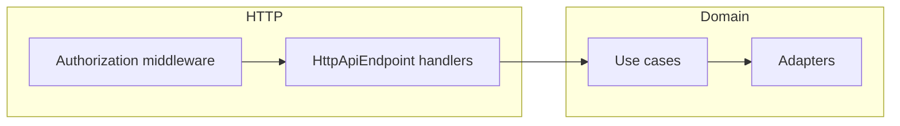

# Error Design

This document describes the error handling strategy for the Inbox Concierge backend ([packages/backend](packages/backend)).

## Overview

Domain failures are modeled as `Schema.TaggedErrorClass` values with an `httpApiStatus` annotation. They are used in use cases, repositories, adapters, and HTTP handlers, and are declared on `HttpApiEndpoint` error unions where the HTTP layer should surface them. The authorization middleware adds its own `UnauthorizedError` (and can fail with `AuthPersistenceError`).

```
┌─────────────────────────────────────────────────────────────┐
│  DOMAIN ERRORS (packages/backend/src/domain/errors/)       │
│  Schema.TaggedErrorClass + { httpApiStatus: number }         │
│  Used in use cases, ports, adapters, handlers                │
└─────────────────────────────────────────────────────────────┘
                              │
                              ▼
┌─────────────────────────────────────────────────────────────┐
│  HTTP API (effect/unstable/httpapi)                         │
│  Per-endpoint error: [...] unions + middleware errors       │
└─────────────────────────────────────────────────────────────┘
```

## Key principles

1. **Typed errors** — Prefer `Schema.TaggedErrorClass` with `{ httpApiStatus }` over untyped `Error` in the error channel.
2. **Flow through** — Avoid mapping one domain error to another unless product or security requires it (for example, hiding whether a user exists).
3. **No manual logging** — Rely on telemetry for error logging.
4. **Do not swallow failures** — Propagate or fail; avoid silent `catchAll` that returns success.
5. **Prefer `Effect.catchAll` over defect catching** — Use `catchAll` for expected tagged errors; avoid routinely catching defects.

---

## Domain errors

**Location:** [packages/backend/src/domain/errors/](packages/backend/src/domain/errors/) — one file per error class (flat layout, no barrel file).

Every error class should:

1. **Extend `Schema.TaggedErrorClass`** — provides `_tag` and a consistent shape.
2. **Set HTTP status** — third constructor argument: `{ httpApiStatus: number }` (maps to response status in the Effect HTTP stack).
3. **Expose a human-readable `message`** — often via `override get message()` when there is no `message` field in the schema.
4. **Export a type guard** — `export const isMyError = Schema.is(MyError)`.

```typescript
import { Schema } from "effect";

import { LabelId } from "#domain/models/label.ts";

export class LabelNotFoundError extends Schema.TaggedErrorClass<LabelNotFoundError>()(
  "LabelNotFoundError",
  {},
  { httpApiStatus: 404 },
) {
  override get message(): string {
    return "Label not found";
  }
}

export const isLabelNotFoundError = Schema.is(LabelNotFoundError);
```

Some errors carry `message` and `cause` in the schema (for example persistence or classification failures) and may provide `static fromError(unknown)` helpers.

### Naming convention

**Pattern:** `{Domain}{Failure}Error`

Examples: `LabelNotFoundError`, `InboxSyncError`, `AuthPersistenceError`.

---

## Usage

### Repositories and use cases return domain errors directly

```typescript
const findById = (id: LabelId) =>
  sql`SELECT * FROM labels WHERE id = ${id}`.pipe(
    Effect.flatMap((rows) =>
      rows.length === 0 ? Effect.fail(new LabelNotFoundError()) : Effect.succeed(rows[0]),
    ),
  );
```

### Errors flow through handlers

When an endpoint’s `error` union includes the failure type, the handler can return the effect without remapping:

```typescript
.handle("updateLabel", ({ path, payload }) => updateLabelUseCase(path.id, payload));
// LabelNotFoundError (404) flows to the HTTP response when declared on the endpoint
```

### Map only when required

When the client must not distinguish two failure modes (for example “user not found” vs “wrong password”), map the sensitive error to a single public type:

```typescript
authService.login(payload).pipe(
  Effect.mapError((error) => {
    if (isUserNotFoundError(error)) {
      return new ProviderAuthFailedError({ reason: "Authentication failed" });
    }
    return error;
  }),
);
```

Use real domain classes from [packages/backend/src/domain/errors/](packages/backend/src/domain/errors/); the names above illustrate the pattern only.

### Use `Effect.orDie` for impossible states

```typescript
const user =
  yield *
  userRepository.findById(membership.userId).pipe(
    Effect.flatMap(
      Option.match({
        onNone: () => Effect.die(new Error(`Data corruption: user ${membership.userId} not found`)),
        onSome: Effect.succeed,
      }),
    ),
  );
```

---

## HTTP status code guidelines

| Status | When to use                                                                                                       |
| ------ | ----------------------------------------------------------------------------------------------------------------- |
| 400    | Invalid input, validation failures, missing prerequisites (for example inbox not connected)                       |
| 401    | Authentication required, session/token invalid or expired                                                         |
| 403    | Authenticated but not allowed                                                                                     |
| 404    | Resource not found                                                                                                |
| 409    | Conflict with existing state                                                                                      |
| 422    | Business rule violation (use when you introduce such errors)                                                      |
| 500    | Unexpected domain or persistence failures                                                                         |
| 502    | Upstream or sync failure (for example [`InboxSyncError`](packages/backend/src/domain/errors/inbox-sync-error.ts)) |
| 503    | Dependency unavailable — for example SQL errors mapped on an endpoint (see below)                                 |

---

## Where errors are wired

### Domain modules

All shared domain error classes live under [packages/backend/src/domain/errors/](packages/backend/src/domain/errors/).

### HTTP groups

Route groups under [packages/backend/src/entrypoints/http/groups/](packages/backend/src/entrypoints/http/groups/) define `HttpApiEndpoint` instances with `success` and `error` schemas. Only errors listed in `error` (and middleware `error`) are part of the documented API contract for that endpoint.

### Authorization middleware

[packages/backend/src/entrypoints/http/middleware/auth.middleware.ts](packages/backend/src/entrypoints/http/middleware/auth.middleware.ts) defines `UnauthorizedError` (401) and lists `error: [UnauthorizedError, AuthPersistenceError]` on the `Authorization` middleware.

### SQL errors as 503

Some endpoints include a schema that maps `SqlError` to **503** so infrastructure failures are not mistaken for application-level denials (for example permission checks that run SQL):

```typescript
const sqlServiceUnavailable = SqlError.pipe(HttpApiSchema.status(503));
// include `sqlServiceUnavailable` in the endpoint `error` array where needed
```

See [packages/backend/src/entrypoints/http/groups/labels/label-api.ts](packages/backend/src/entrypoints/http/groups/labels/label-api.ts).

### Flow (high level)



---

## Error catalog

### Middleware

| Error class         | HTTP status | Role                                                                                                                             |
| ------------------- | ----------- | -------------------------------------------------------------------------------------------------------------------------------- |
| `UnauthorizedError` | 401         | Missing or invalid session; defined in [auth.middleware.ts](packages/backend/src/entrypoints/http/middleware/auth.middleware.ts) |

### Domain error classes (`domain/errors/`)

| Error class               | HTTP status | HTTP API notes                                                                                                                                  |
| ------------------------- | ----------- | ----------------------------------------------------------------------------------------------------------------------------------------------- |
| `AuthPersistenceError`    | 500         | Middleware; `auth` callback; `authSession` logout/refresh; `threads` sync                                                                       |
| `ClassificationError`     | 500         | Message classifier adapter — not listed on `HttpApiEndpoint` unions                                                                             |
| `InboxNotConnectedError`  | 400         | `auth` callback; `threads` sync                                                                                                                 |
| `InboxPersistenceError`   | 500         | `auth` callback; `threads` list/sync                                                                                                            |
| `InboxSyncError`          | 502         | `auth` callback; `threads` sync                                                                                                                 |
| `LabelAlreadyExistsError` | 409         | `labels` create                                                                                                                                 |
| `LabelNotFoundError`      | 404         | `labels` update/delete                                                                                                                          |
| `LabelPersistenceError`   | 500         | `auth` callback; `labels`                                                                                                                       |
| `OAuthStateError`         | 400         | `auth` callback                                                                                                                                 |
| `OAuthTokenExpiredError`  | 401         | Defined; not referenced elsewhere yet                                                                                                           |
| `PermissionDeniedError`   | 403         | `labels` mutating routes                                                                                                                        |
| `ProviderAuthFailedError` | 401         | `auth` callback                                                                                                                                 |
| `ProviderNotEnabledError` | 404         | Defined; not referenced elsewhere yet                                                                                                           |
| `SessionExpiredError`     | 401         | [validate-session](packages/backend/src/use-cases/validate-session.use-case.ts) use case — not listed on current `HttpApiEndpoint` error unions |
| `SessionNotFoundError`    | 401         | `authSession` logout                                                                                                                            |
| `TokenEncryptionError`    | 500         | Token encryption adapter — not listed on `HttpApiEndpoint` unions                                                                               |
| `UserAlreadyExistsError`  | 409         | Defined; not referenced elsewhere yet                                                                                                           |
| `UserNotFoundError`       | 404         | Defined; not referenced elsewhere yet                                                                                                           |

### Non-domain error schema on endpoints

| Schema                                  | Status | Where                                        |
| --------------------------------------- | ------ | -------------------------------------------- |
| `SqlError` (via `HttpApiSchema.status`) | 503    | `labels` routes (as `sqlServiceUnavailable`) |

---

## Anti-patterns

### Excessive mapping

**Avoid** remapping a domain error to a different type solely to satisfy an older generic API shape. Prefer extending the endpoint `error` union with the concrete error.

**Prefer** letting the same class flow from the use case to the handler when it is already in the union.

### Manual logging in business logic

**Avoid** `Effect.tapError` logging in domain code for routine failures; use platform telemetry.

### Swallowing errors

**Avoid** `Effect.catchAll(() => Effect.succeed(...))` unless the operation is explicitly optional and that behavior is documented.

---

## Adding a new error

1. Add `your-error.ts` under [packages/backend/src/domain/errors/](packages/backend/src/domain/errors/) with `Schema.TaggedErrorClass`, `{ httpApiStatus }`, and `Schema.is`.
2. Import the class into the relevant `HttpApiGroup` `*-api.ts` file and add it to each `HttpApiEndpoint` `error` array that should return it.
3. Use `new YourError({ ... })` from use cases or handlers as appropriate.

---

## Summary

| Aspect      | Approach                                                                   |
| ----------- | -------------------------------------------------------------------------- |
| Error model | `Schema.TaggedErrorClass` + `{ httpApiStatus }`                            |
| Location    | `packages/backend/src/domain/errors/*.ts`                                  |
| HTTP        | `effect/unstable/httpapi` — endpoint `error` unions + middleware `error`   |
| Auth        | `UnauthorizedError` + `AuthPersistenceError` on `Authorization` middleware |
